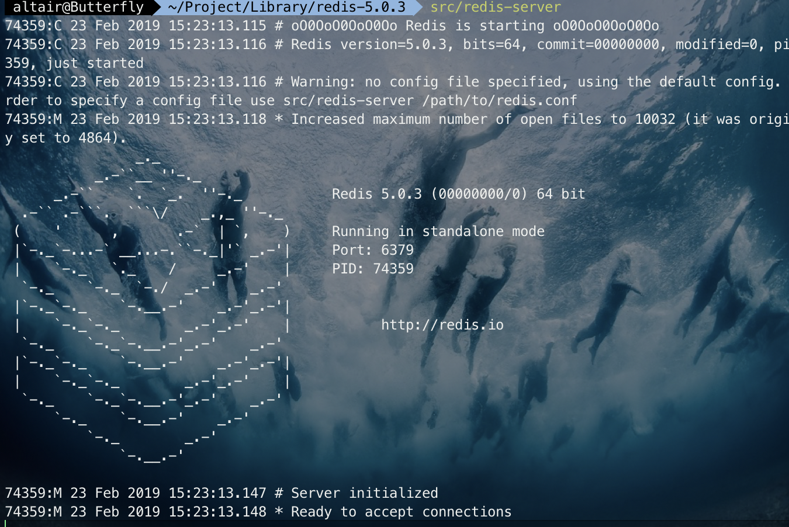
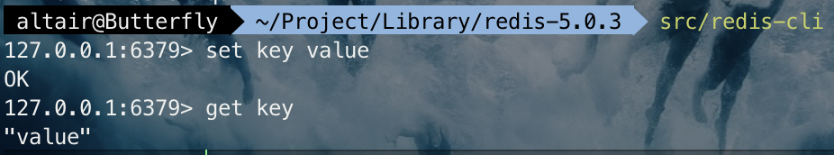

## 安装

- [官方地址：Redis](https://redis.io/download)

##### 下载、解压、编译
```bash
#下载
 wget http://download.redis.io/releases/redis-5.0.3.tar.gz

#解压
 tar xzf redis-5.0.3.tar.gz
 
 cd redis-5.0.3
 
#编译
 make
```
##### 运行

```
src/redis-server
```



##### 使用内置客户端，与 Redis 交互

```
src/redis-cli
```



