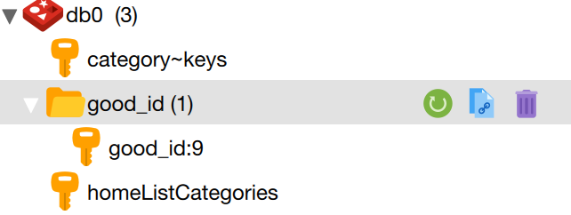

## Controller
- 请求`Redis Cache`的最佳位置
- 使请求不必进入`service`层，等待查询缓存结果


注释|作用|
---|---|
@Cacheable | 写入缓存 | @GetMapping
@CachePut  | 更新缓存数据   | @PutMapping
@CacheEvict | 清除缓存中 | @DeletMapping
@CacheConfig| 在类层设置全局值，例如`CacheName` 和 `KeyGenerator`
@Caching|在一个方法上应用多种缓存策略：`Cacheable`、`CachePut`、`CacheEvict`

### @Cacheable
##### 含义
- 表明该方法调用后，返回的结果，可以被缓存。
- 下次请求使用相同参数时，该方法将不会执行，直接从缓存中加载结果

##### 特征
- 选择性缓存：缓存最常访问的数据，避被算法清除

##### 建议
- 使用传入方法的参数，动态计算 key
- 使用 SPEL： `Spring Expression Language`


##### 属性
属性|含义|作用|备注
---|---|---|---
value|`cacheName`别名
cacheName|缓存名称| 存储多个 key 
key|动态计算key值|默认`""`：所有方法参数可引用为key|单引号`" 'key_name' "`==使key作为字符串格式使用==
unless|禁止缓存|默认`""`：从不禁止缓存|
condition|选择性缓存|默认`""`：总是缓存方法返回的结果
keyGenerator|自定义 `KeyGenerator` 的bean名称
sync| 使底层方法，在多个线程通过相同 key 加载同一个值时，保持同步

##### `SPEL`专用元数据（meta-data）

表达式|含义|SPEL| 参数
---|---|---|---
 "#root.method"| 引用方法
 "#root.target"| 引用目标对象
 "#root.caches"| 引用相应的缓存
 "#root.methodName"| 引用方法名称
 "#root.targetCalss"| 引用目标类
 "#root.args[1]"| 引用第1个方法参数
 "#p1"|    引用第1个方法参数
 "#a1"|    引用第1个方法参数
"#id"| 引用名字为`id`的参数|`key = "#id"` |`(@PathVariable String id)`


##### unless 可用的`SPEL`元数据（meta-data）
表达式|含义
---|---
"#result"| 引用方法返回的结果<br> 例如：方法返回的对象


##### 例子
- 实体

```java
public class Post implements Serializable {
    private int shares; //  实体类的 shares 属性，被 unless 引用
}
```

- 缓存单个实例

    > #result 相当于 Post 实例，这里可引用它的 shares 属性
```java
@Cacheable(value = "post-single", key = "#id", unless = "#result.shares < 500")
@GetMapping("/{id}")
public Post getPostByID(@PathVariable String id) throws PostNotFoundException {
    log.info("get post with id {}", id);
    return postService.getPostByID(id);
}
```
- 缓存多个实例
```java
@Cacheable(value = "post-top")
@GetMapping("/top")
public List<Post> getTopPosts() {
    return postService.getTopPosts();
}
```
###### 资料来源
- [Cacheable (Spring Framework 5.1.5.RELEASE API)](https://docs.spring.io/spring/docs/5.1.x/javadoc-api/org/springframework/cache/annotation/Cacheable.html)

> Annotation indicating that the result of invoking a method (or all methods in a class) can be cached.
Each time an advised method is invoked, caching behavior will be applied, checking whether the method has been already invoked for the given arguments. A sensible default simply uses the method parameters to compute the key, but a SpEL expression can be provided via the key() attribute, or a custom KeyGenerator implementation can replace the default one (see keyGenerator()).
> 
> If no value is found in the cache for the computed key, the target method will be invoked and the returned value stored in the associated cache. Note that Java8's Optional return types are automatically handled and its content is stored in the cache if present.
> 
> This annotation may be used as a meta-annotation to create custom composed annotations with attribute overrides.


### @CachePut
- 每次调用被注释的方法，都会更新缓存中的实体。
- 缓存一个实体，而非多个实体。无法实时刷新前台的数据集合。
- 不适合刷新 Category 这样稳定的数据
- 适合刷新 Product 这样经常变化的数据（销量、价格、评论数等属性值经常变动）

#####  区别
注释|区别
---|---
`@Cachebale`|会跳过已进行缓存的方法
`@CachePut` |总是调用方法，其结果存储在缓存中

> Code below updates post and return it for cache provider to change entry with new value.

```java
    @CachePut(value = "category", key = " 'good_id:' + #good_id ") //  key 
    public Result getGood(@PathVariable int good_id){
        ...
    }
```
- 生成的 `key` 如图所示
- 使用冒号 `:` ，会同时生成命名空间
<center>


</center>

###### 资料来源
- [CachePut (Spring Framework 5.1.5.RELEASE API)](https://docs.spring.io/spring/docs/5.1.x/javadoc-api/org/springframework/cache/annotation/CachePut.html)
> Annotation indicating that a method (or all methods on a class) triggers a cache put operation.
In contrast to the @Cacheable annotation, this annotation does not cause the advised method to be skipped. Rather, it always causes the method to be invoked and its result to be stored in the associated cache. Note that Java8's Optional return types are automatically handled and its content is stored in the cache if present.
> 
> This annotation may be used as a meta-annotation to create custom composed annotations with attribute overrides.


### @CacheEvict
- 从缓存中移除实体

```java
@CacheEvict(value = "post-single", key = "#id")
@DeleteMapping("/delete/{id}")
public void deletePostByID(@PathVariable String id) throws PostNotFoundException {
    log.info("delete post with id {}", id);
    postService.deletePost(id);
}
```
##### 属性
属性|含义|作用
---|---|---|
allEntries | 清除所有实体的缓存|默认：只清除关联特定 key 的值
beforeInvocation|方法执行前清除缓存|默认`false`：当被注释的方法成功执行后，清除缓存
condition| 选择性清除缓存|默认`""`：总是执行清除缓存

###### 资料来源
- [CacheEvict (Spring Framework 5.1.5.RELEASE API)](https://docs.spring.io/spring/docs/5.1.x/javadoc-api/org/springframework/cache/annotation/CacheEvict.html#allEntries--)

---
### 其他注释
#### @EnableCaching
- 检查配置类的 `beans` 
- 寻找被`@Cacheable` `@CachePut` `@CacheEvict`标记的方法
- 创建代理，拦截所有请求

#### @Caching
- 集成多个类型的注释（Cacheable、CachePut、CacheEvict）
- 当需要使用不同的条件和缓存时使用
>  Aggregate multiple annotations of the same type when e.g. you need to use different conditions and caches

#### CacheConfig
- 类层面的注释
- 允许为`cache name` `key generator` 这一类的注释，指定全局值
- 相当于方法层面的注释： `@Cacheable(value="categories")`

```java
@Service
@CacheConfig(cacheNames = "categories")
public class CategoryService {
    ...
}
```

```java
@GetMapping("/forehome")
@Cacheable(value = "categories")
public List<Category> home() {
    ...
    return categories;
}
```

---
###### 资料来源

- 官方文档：[Spring Data Redis](https://docs.spring.io/spring-data/data-redis/docs/current/reference/html/#redis:connectors:jedis)

- IBM_Demo： [开发 Spring Redis 应用程序](https://www.ibm.com/developerworks/cn/java/os-springredis/index.html)
- 关于序列化：[Springboot整合redis - 简书](https://www.jianshu.com/p/7f6a180e6ee7)

- 关于key操作：[Spring Data Redis Example](https://www.concretepage.com/spring-4/spring-data-redis-example)

- 关于 `Cache` 的Spring 官方手册：[Cache Abstraction](https://docs.spring.io/spring/docs/current/spring-framework-reference/integration.html#cache)

- 关于CRUD的注释：[Spring Boot Redis Cache - JournalDev](https://www.journaldev.com/18141/spring-boot-redis-cache)

- 注释详情、详细配置、Docker：[Spring Boot cache with Redis – Matthew Frank – Medium](https://medium.com/@MatthewFTech/spring-boot-cache-with-redis-56026f7da83a)


- 设置为Hash数据类型：[Introduction to Spring Data Redis | Baeldung](https://www.baeldung.com/spring-data-redis-tutorial)

- 含前端操作的Demo：[Intro to Redis With Spring Boot - DZone Database](https://dzone.com/articles/intro-to-redis-with-spring-boot)

- 与how2j类似的配置： [Spring Boot中Redis的使用 - 纯洁的微笑 - 博客园 ](https://www.cnblogs.com/ityouknow/p/5748830.html)
